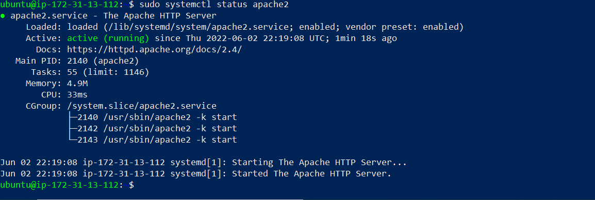

## Documentation of project 1

`updated the server with: sudo apt update`

`installed apache 2 server with: sudo apt install apache2`

`I verified that apache 2 is running with: sudo systemctl status apache2`

`added a rule to EC2 configuration to open inbound connection through port 80`

`i confirmed that Apache HTTP server can respond to requests by accessing through a browser with http://13.40.138.191/:80`

`mysql server was installed with: sudo apt install mysql-server`

`i logged into the sql console by typing : sudo mysql`

`I ran the security script that comes pre-installed with MySQL`

`Start the interactive script by running: sudo mysql_secure_installation`

`The password plugins was validated, and a level 0 password chossen`

`I confirmed i was able to log into the Mysql with the new password`

`Futhermore, i installed 3 packeges at once which are php, php-mysql, libapace2-mod-php`

` confimed PHP installation with : php -v`

`i proceede to creating a virtual host for my webpage using apache using the following commands`

`Create the directory for projectlamp using: sudo mkdir /var/www/projectlamp`

`assign ownership of the directory to my system user using: sudo chown -R $USER:$USER /var/www/projectlamp`

`create and open a new configuration file in Apache’s sites-available directory using vi editor`

`ran the following ls command to available work space: sudo ls /etc/apache2/sites-available  `

`I then  disabled the default website that comes installed with Apache using :sudo a2dissite 000-default`

`I ran the following code to ensure configuration file does not contain syntax errror: sudo apache2ctl configtest`

`reloaded apache so the changes takes effect using: sudo systemctl reload apache2`

`i then created an index.html file in  /var/www/projectlamp with the following text : sudo echo 'Hello LAMP from hostname' $(curl -s http://169.254.169.254/latest/meta-data/public-hostname) 'with public IP' $(curl -s http://169.254.169.254/latest/meta-data/public-ipv4) > /var/www/projectlamp/index.html`

`i then went to my browser and try to open your website URL using: http://http://18.132.45.250/:80`

`The next step was to enable php on website, to do this i had to edit the /etc/apache2/mods-enabled/dir.conf file and change the order in which the index.php file is listed within the DirectoryIndex directive through vim editor using: sudo vim /etc/apache2/mods-enabled/dir.conf `
 
 

`After saving and closing the file, i then reloaded Apache so the changes would take effect using: sudo systemctl reload apache2`

`Now that you i have a custom location to host my website’s files and folders, i created a PHP test script to confirm that Apache is able to handle and process requests for PHP file. to do this, i Created a new file named index.php inside my custom web root folder, with a vim editor : vim /var/www/projectlamp/index.php , and added the following text `

` after that i save and close the file, refresh the page and got the below webpage:`

